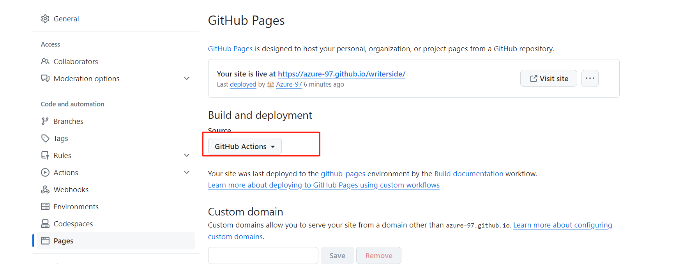

# writerside 部署到github

writerside 部署文档
https://www.jetbrains.com/help/writerside/deploy-docs-to-github-pages.html#publish

## step1
在.github/workflows/目录下，创建一个新的YAML文件build-docs.yml


## setp2
粘贴下面的内容到build-docs.yml
```
branches: ["main"]  
INSTANCE: 'Writerside/hi'
ARTIFACT: 'webHelpHI2-all.zip'
DOCKER_VERSION: '241.16003'
```

根据实际变更


```build-docs.yml
name: Build documentation

on:
  push:
    branches: ["main"]
  workflow_dispatch:

permissions:
  id-token: write
  pages: write

env:
  INSTANCE: 'Writerside/hi'
  ARTIFACT: 'webHelpHI2-all.zip'
  DOCKER_VERSION: '241.16003'

jobs:
  build:
    runs-on: ubuntu-latest
    steps:
      - name: Checkout repository
        uses: actions/checkout@v4
        with:
          fetch-depth: 0

      - name: Build docs using Writerside Docker builder
        uses: JetBrains/writerside-github-action@v4
        with:
          instance: ${{ env.INSTANCE }}
          artifact: ${{ env.ARTIFACT }}
          docker-version: ${{ env.DOCKER_VERSION }}

      - name: Save artifact with build results
        uses: actions/upload-artifact@v4
        with:
          name: docs
          path: |
            artifacts/${{ env.ARTIFACT }}
            artifacts/report.json
          retention-days: 7
  test:
    needs: build
    runs-on: ubuntu-latest
    steps:
      - name: Download artifacts
        uses: actions/download-artifact@v4
        with:
          name: docs
          path: artifacts

      - name: Test documentation
        uses: JetBrains/writerside-checker-action@v1
        with:
          instance: ${{ env.INSTANCE }}
  deploy:
    environment:
      name: github-pages
      url: ${{ steps.deployment.outputs.page_url }}
    needs: [build, test]
    runs-on: ubuntu-latest
    steps:
      - name: Download artifacts
        uses: actions/download-artifact@v4
        with:
          name: docs

      - name: Unzip artifact
        run: unzip -O UTF-8 -qq '${{ env.ARTIFACT }}' -d dir

      - name: Setup Pages
        uses: actions/configure-pages@v4

      - name: Package and upload Pages artifact
        uses: actions/upload-pages-artifact@v3
        with:
          path: dir

      - name: Deploy to GitHub Pages
        id: deployment
        uses: actions/deploy-pages@v4
```
## step3
打开GitHub上的存储库，单击Settings，然后单击Code和automation下的Pages，然后在Build和deployment下选择GitHub Actions作为源。

